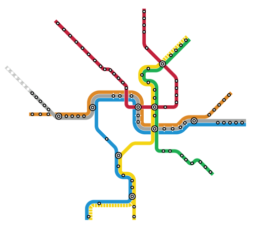
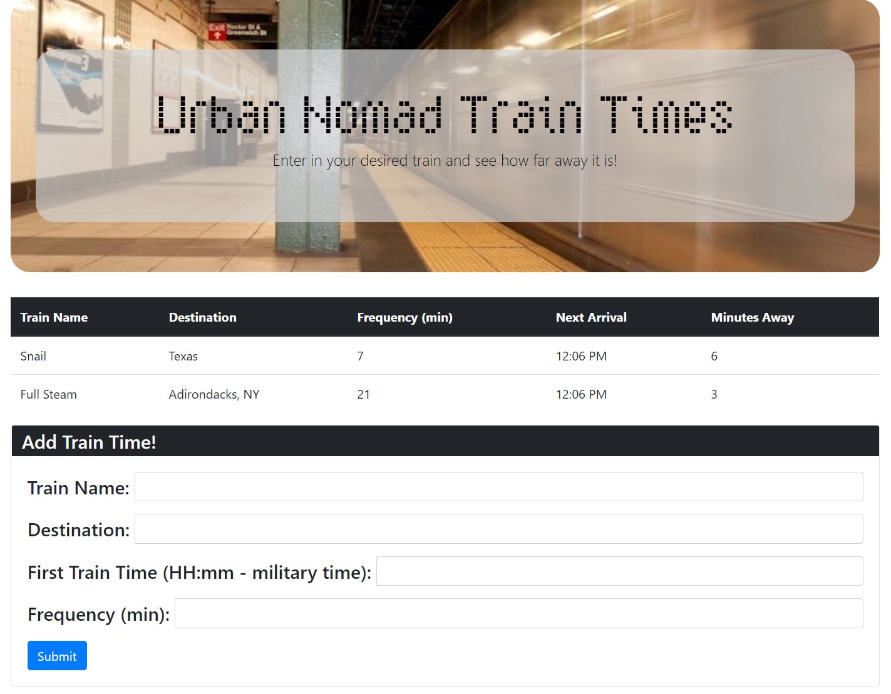

# Train-Schedule

This is a sample application built to demo Firebase. The funcationality is providing a realtime display scheduling notepad tracker. What that means is people can enter their train name, destination and when ittypically starts along side its frequency and what they get back is all that data saves in addition to the next train as well as the minutes left to its arrival. This would be useful for those seeking to map their train schedule for the day and recall it automatically formt he cloud without having to worry about storing the data.

## Screenshot of the app!

